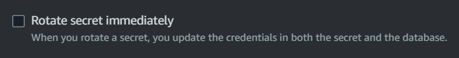

# aws-rds-sm-rotation

AWS Secrets Manager stored credential rotation with RDS.

Create the `./infra/.auto.tfvars` file:

```terraform
aws_region = "us-east-2"
```

Create the infrastructure:

```sh
terraform -chdir="infra" init
terraform -chdir="infra" apply -auto-approve
```

Output will show the Secrets Manager key for the configuration.

⚠️ It appears that rotating the master secret using RDS console, the server will become unavailable.



💡 However, when a secret is rotated using Secrets Manager, there is no unavailability. Probably need to run more tests on this.

Create the `app.env` file:

```sh
RDS_MYSQL_ADDRESS="database-1.00000000000.us-east-2.rds.amazonaws.com"
SECRET_ID="rds!db-00000000-0000-0000-0000-000000000000"
```

You can hit the SM API directly or use a [cached secret][1]. As of right now cached is waiting for [V2][2] to be merged.

> When you retrieve a secret, you can use the Secrets Manager Go-based caching component to cache it for future use. Retrieving a cached secret is faster than retrieving it from Secrets Manager. Because there is a cost for calling Secrets Manager APIs, using a cache can reduce your costs.

Run the application:

```sh
go get
go run .
```

[1]: https://docs.aws.amazon.com/secretsmanager/latest/userguide/retrieving-secrets_cache-go.html
[2]: https://github.com/aws/aws-secretsmanager-caching-go/pull/40
